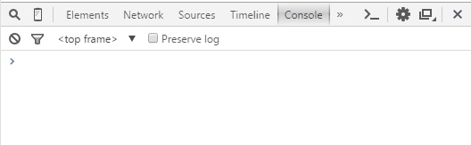
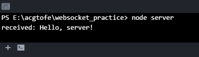
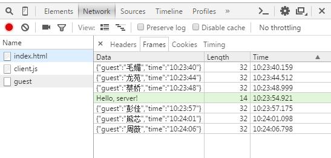

# Websocket协议介绍及websocket API应用

WebSocket 是由HTML5提出的一个独立的协议标准。WebSocket可以分为协议（Protocol）和API两部分，分别由IETF和W3C制定了标准。它跟HTTP协议基本没有关系，只是为了兼容现有浏览器的握手规范而对 HTTP 协议的一种补充。更加确切的说 WebSocket 利用了 HTTP 协议来建立连接，仅此而已。

## websocket协议介绍

现在 WebSocket 协议已经成了标准协议，所有主流浏览器都已经很好的支持其基础功能。

WebSocket 协议实现了浏览器与服务器全双工通信，能更好的节省服务器资源和带宽并达到实时通讯的目的。它与HTTP一样通过已建立的TCP连接来传输数据，但是它和HTTP最大不同是：

1. WebSocket是一种双向通信协议。在建立连接后，WebSocket服务器端和客户端都能主动向对方发送或接收数据，就像Socket一样；
1. WebSocket需要像TCP一样，先建立连接，连接成功后才能相互通信。


上图对比可以看出，相对于传统HTTP每次请求-应答都需要客户端与服务端建立连接的模式，WebSocket是类似Socket的TCP长连接通讯模式。一旦WebSocket连接建立后，后续数据都以帧序列的形式传输。在客户端断开WebSocket连接或Server端中断连接前，不需要客户端和服务端重新发起连接请求。在海量并发及客户端与服务器交互负载流量大的情况下，极大的节省了网络带宽资源的消耗，有明显的性能优势，且客户端发送和接受消息是在同一个持久连接上发起，实时性优势明显。

## WebSocket 协议的建立过程

接下来我们来了解一下 WebSocket 协议的建立过程：

WebSocket 连接必须由浏览器发起，请求协议是一个标准的HTTP请求（也就是说，WebSocket的建立是依赖HTTP的）。请求报文格式如下：

``` javascript

GET ws://localhost:3000/ws/chat HTTP/1.1
Host: localhost
Upgrade: websocket
Connection: Upgrade
Origin: http://localhost:3000
Sec-WebSocket-Key: client-random-string
Sec-WebSocket-Version: 13

```

该请求和普通的HTTP请求有几点不同：

1. 其中 HTTP 头部字段 **Upgrade: websocket** 和 **Connection: Upgrade** 很重要，告诉服务器通信协议将发生改变，转为 WebSocket 协议。
1. **Sec-WebSocket-Key** 是用于标识这个连接，并非用于加密数据；
1. **Sec-WebSocket-Version** 指定了WebSocket的协议版本。

> 支持 WebSocket 的服务器端在确认以上请求后，应返回状态码为101 Switching Protocols的响应

``` javascript

HTTP/1.1 101 Switching Protocols
Upgrade: websocket
Connection: Upgrade
Sec-WebSocket-Accept: nRu4KAPUPjjWYrnzxDVeqOxCvlM=

```

该响应代码 101 表示本次连接的HTTP协议即将被更改，更改后的协议就是 **Upgrade: websocket** 指定的WebSocket协议。

版本号和子协议规定了双方能理解的数据格式，以及是否支持压缩等等。如果仅使用 WebSocket 的 API ，就不需要关心这些。

现在，一个 WebSocket 连接就建立成功，浏览器和服务器就可以随时主动发送消息给对方。消息有两种，一种是文本，一种是二进制数据。通常，我们可以发送JSON格式的文本，这样，在浏览器处理起来就十分容易。

为什么 WebSocket 连接可以实现全双工通信而 HTTP 连接不行呢？实际上HTTP协议是建立在TCP协议之上的，TCP协议本身就实现了全双工通信，但是HTTP 协议的请求－应答机制限制了全双工通信。WebSocket连接建立以后，接下来的通信就不使用 HTTP 协议了，直接互相发数据。

安全的 WebSocket 连接机制和 HTTPS 类似。首先，浏览器用 **wss://xxx** 创建 WebSocket 连接时，会先通过HTTPS创建安全的连接，然后，该HTTPS 连接升级为 WebSocket 连接，底层通信走的仍然是安全的 SSL/TLS 协议。

## WebSocket 、Ajax 轮询 和 Long Poll(长轮询) 原理解析

说到 WebSocket ，那就不得不说说 Ajax 轮询 和 Long Poll(长轮询)。

Ajax 轮询 和 Long Poll(长轮询) 都是 HTTP 请求的应用，都属于非持久连接。

首先来说说 Ajax 轮询。Ajax 轮询的原理非常简单，让浏览器每隔一定的时间就发送一次请求，询问服务器是否有新信息。

Long Poll(长轮询) 其实原理跟 Ajax 轮询 差不多，都是采用轮询的方式，不过采取的是阻塞模型，也就是说，客户端发起连接后，如果没消息，服务器不会马上告诉你没消息，而是将这个请求挂起（pending），直到有消息才返回。返回完成或者客户端主动断开后，客户端再次建立连接，周而复始。我们可以看出Long Poll(长轮询) 已经具备了一定的实时性。

上面这两种应用都是非常消耗资源。Ajax 轮询需要服务器有很快的处理速度和资源。Long Poll(长轮询) 需要有很高的并发，也就是说同时连接数的能力。同时也受到客户端的连接数限制，比如老早的IE6，客户端同事连接数为2。尽管如此，在过去 Ajax 轮询 和 Long Poll(长轮询) 还是有广泛的应用，特别是实时聊天，短消息推送等方面， Long Poll(长轮询) 是除了 Flash 之外唯一的选择。

相对于 HTTP 连接的非持久连接来说，WebSocket 则是非持久连接。

上面已经说了 WebSocket 是类似 Socket 的TCP长连接通讯模式。一旦 WebSocket 连接建立后，后续数据都以帧序列的形式传输。而且浏览器和服务器就可以随时主动发送消息给对方，是全双工通信。在海量并发及客户端与服务器交互负载流量大的情况下，极大的节省了网络带宽资源的消耗，有明显的性能优势，且客户端发送和接受消息是在同一个持久连接上发起，实时性优势明显。

## WebSocket API

WebSocket 客户端的 API 和流程非常简单：创建 WebSocket 对象，然后指定 open、message等事件的回调即可。其中 message 是客户端与服务器端通过WebSocket通信的关键事件，想要在收到服务器通知后做点什么，写在message事件的回调函数里就好了：

### WebSocket 构造函数

WebSocket 对象作为一个构造函数，用于新建 WebSocket 实例。

``` javascript
var ws = new WebSocket('ws://localhost:8080/ws');

```

执行上面语句之后，客户端就会与服务器进行连接。实例对象的所有属性和方法参见 [WebSocket](https://developer.mozilla.org/en-US/docs/Web/API/WebSocket) 。

### webSocket.readyState

**readyState** 属性返回实例对象的当前状态，共有四种。

1. **CONNECTING** ：值为0，表示正在连接。
1. **OPEN** ：值为1，表示连接成功，可以通信了。
1. **CLOSING** ：值为2，表示连接正在关闭。
1. **CLOSED** ：值为3，表示连接已经关闭，或者打开连接失败。

``` javascript

switch (ws.readyState) {
  case WebSocket.CONNECTING:
    // do something
    break;
  case WebSocket.OPEN:
    // do something
    break;
  case WebSocket.CLOSING:
    // do something
    break;
  case WebSocket.CLOSED:
    // do something
    break;
  default:
    // this never happens
    break;
}

```

### webSocket.onopen

实例对象的 onopen属性，用于指定连接成功后的回调函数。

```javascript
ws.onopen = function(){
    ws.send('Hello Server!');
}

```

如果要指定多个回调函数，可以使用addEventListener方法。

``` javascript

ws.addEventListener('open', function(event){
    ws.send('Hello Server!');
});

```

### webSocket.onclose

实例对象的 onclose 属性，用于指定连接关闭后的回调函数。

``` javascript

ws.onclose = function(event) {
  var code = event.code;
  var reason = event.reason;
  var wasClean = event.wasClean;
  // handle close event
};

ws.addEventListener("close", function(event) {
  var code = event.code;
  var reason = event.reason;
  var wasClean = event.wasClean;
  // handle close event
});

```

### webSocket.onmessage

实例对象的 onmessage 属性，用于指定收到服务器数据后的回调函数。

``` javascript

ws.onmessage = function(event) {
  var data = event.data;
  // 处理数据
};

ws.addEventListener("message", function(event) {
  var data = event.data;
  // 处理数据
});

```

> 注意，服务器数据可能是文本，也可能是二进制数据（ Blob 对象或 ArrayBuffer 对象）。

``` javascript

ws.onmessage = function(event){
  if(typeof event.data === String) {
    console.log("Received data string");
  }

  if(event.data instanceof ArrayBuffer){
    var buffer = event.data;
    console.log("Received arraybuffer");
  }
}

```

除了动态判断收到的数据类型，也可以使用binaryType属性，显式指定收到的二进制数据类型。

``` javascript

// 收到的是 blob 数据
ws.binaryType = "blob";
ws.onmessage = function(e) {
  console.log(e.data.size);
};

// 收到的是 ArrayBuffer 数据
ws.binaryType = "arraybuffer";
ws.onmessage = function(e) {
  console.log(e.data.byteLength);
};

```

### webSocket.send()

实例对象的send()方法用于向服务器发送数据。

发送文本的例子。

``` javascript

ws.send('your message');

```

发送 Blob 对象的例子。

``` javascript

var file = document
  .querySelector('input[type="file"]')
  .files[0];
ws.send(file);

```

发送 ArrayBuffer 对象的例子

``` javascript

// Sending canvas ImageData as ArrayBuffer
var img = canvas_context.getImageData(0, 0, 400, 320);
var binary = new Uint8Array(img.data.length);
for (var i = 0; i < img.data.length; i++) {
  binary[i] = img.data[i];
}
ws.send(binary.buffer);

```

### webSocket.bufferedAmount

实例对象的bufferedAmount属性，表示还有多少字节的二进制数据没有发送出去。它可以用来判断发送是否结束。

``` javascript
var data = new ArrayBuffer(10000000);
socket.send(data);

if (socket.bufferedAmount === 0) {
  // 发送完毕
} else {
  // 发送还没结束
}

```

### webSocket.onerror

实例对象的onerror属性，用于指定报错时的回调函数。

``` javascript
socket.onerror = function(event) {
  // handle error event
};

socket.addEventListener("error", function(event) {
  // handle error event
});

```

## 简单示例

### 服务器端

以Node的服务器为例，我们使用ws这个组件，这样搭建一个支持WebSocket的服务器端：

``` javascript

var request = require("request");
var dateFormat = require("dateformat");
var WebSocket = require("ws"),
    WebSocketServer = WebSocket.Server,
    wss = new WebSocketServer({
        port: 8080,
        path: "/guest"
    });

// 收到来自客户端的连接请求后，开始给客户端推消息
wss.on("connection", function(ws) {
    ws.on("message", function(message) {
        console.log("received: %s", message);
    });
    sendGuestInfo(ws);
});

function sendGuestInfo(ws) {
    request("http://uinames.com/api?region=china",
        function(error, response, body) {
            if (!error && response.statusCode === 200) {
                var jsonObject = JSON.parse(body),
                    guest = jsonObject.name + jsonObject.surname,
                    guestInfo = {
                        guest: guest,
                        time: dateFormat(new Date(), "HH:MM:ss")
                    };

                if (ws.readyState === WebSocket.OPEN) {

                    // 发，送
                    ws.send(JSON.stringify(guestInfo));

                    // 用随机来“装”得更像不定时推送一些
                    setTimeout(function() {
                        sendGuestInfo(ws);
                    }, (Math.random() * 5 + 3) * 1000);
                }
            }
        });
}

```

这个例子使用了姓名生成站点 uinames 的API服务，来生成{guest: "人名", time: "15:26:01"}这样的数据。函数sendGuestInfo()会不定时执行，并把包含姓名和时间的信息通过send()方法发送给客户端。另外，注意send()方法需要以字符串形式来发送json数据。

这就像是服务器自己在做一些事，然后在需要的时候会通知客户端一些信息。

### 客户端

客户端我们使用原生javascript来完成（仅支持WebSocket的浏览器）：

``` javascript

var socket = new WebSocket("ws://localhost:8080/guest");

socket.onopen = function(openEvent) {
    console.log("WebSocket conntected.");
};

socket.onmessage = function(messageEvent) {
    var data = messageEvent.data,
        dataObject = JSON.parse(data);
    console.log("Guest at " + dataObject.time + ": " + dataObject.guest);
};

socket.onerror = function(errorEvent) {
    console.log("WebSocket error: ", errorEvent);
};

socket.onclose = function(closeEvent) {
    console.log("WebSocket closed.");
};

```

WebSocket的URL格式是 **ws://**与 **wss://**。因此，需要注意下URL地址的写法，这也包括注意WebSocket服务器端的路径（如这里的/guest）等信息。因为是本地的示例所以这里是localhost。

### 效果及分析

通过 *node server*（假定服务器端的文件名为*server.js*）启动WebSocket服务器后，用浏览器打开一个引入了前面客户端代码的html（直接文件路径file:///就可以），就可以得到像这样的结果：



联系前面客户端的代码可以想到，实际从创建WebSocket对象的语句开始，连接请求就会发送，并很快建立起WebSocket连接（不出错误的话），此后就可以收到来自服务器端的通知。如果此时客户端还想再告诉服务器点什么，这样做：

``` javascript

socket.send("Hello, server!");

```

服务器就可以收到：



当然，这也是因为前面服务器端的代码内同样设置了 message 事件的回调。在这个客户端和服务器都是javascript的例子中，无论是服务器端还是客户端，都用 send() 发送信息，都通过 message 事件设置回调，形式上可以说非常一致。

### 其他可用的数据类型

WebSocket的 send()可以发送的消息，除了前面用的字符串类型之外，还有两种可用，它们是 Blob 和 ArrayBuffer 。

它们都代表二进制数据，可用于原始文件数据的发送。比如，这是一个发送Blob类型数据以完成向服务器上传图片的例子：

``` javascript

var fileEl = document.getElementById("image_upload");
var file = fileEl.files[0];
socket.send(file);

```

然后服务器端可以这样把文件保存下来:

``` javascript

var fs = require("fs");

wss.on("connection", function(ws) {
    ws.on("message", function(message) {
        fs.writeFile("upload.png", message, "binary", function(error) {
            if (!error) {
                console.log("File saved.");
            }
        });
    });
});

```

在客户端接收二进制数据时，需注意WebSocket对象有一个属性 binaryType ，初始值为"blob"。因此，如果接收的二进制数据是ArrayBuffer，应在接收之前这样做：

``` javascript

socket.binaryType = "arraybuffer";

```

### 在Chrome开发工具中查看WebSocket数据帧

Chrome开发工具中选择 Network，然后找到WebSocket的那个请求，里面可以选择 Frames 。在Frames里看到的，就是WebSocket的数据帧了：



[Source Link](wax1aeg0@bccto.me)